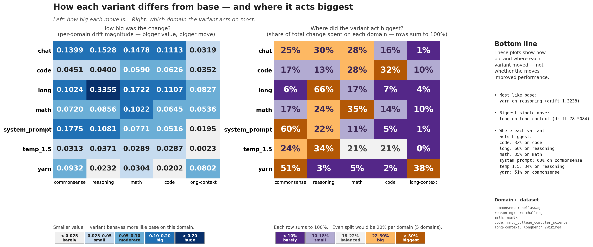

# lmdiff

> Measures **how** and **where** two LLM configurations differ — not just whether one scores higher.

Compare language model **configurations** — not just weights, but weights + context + decoding + adapter + agent — via behavioral distance and multi-level diagnostics.

## Why lmdiff?

`lm-eval-harness` tells you "model A scores 3 points higher than model B on MMLU." That's a scalar.

lmdiff tells you *where* those 3 points came from: which capabilities shifted, how far the output distribution moved, and whether two different modifications (e.g. a fine-tune vs. a context change) push behavior in the same direction or in opposite directions.

A **Configuration** is `model + context + decoding + adapter + agent scaffold`, not just model weights. Same checkpoint with a different system prompt is a different config — and lmdiff can quantify the difference.

## Install

```bash
pip install lmdiff-kit==0.3.2

# With lm-eval-harness task loader (hellaswag, arc, gsm8k, mmlu, ...)
pip install "lmdiff-kit[lm-eval]"

# With matplotlib figures + radar plots
pip install "lmdiff-kit[viz]"

# Both
pip install "lmdiff-kit[lm-eval,viz]"
```

The import name is `lmdiff`; the PyPI distribution is `lmdiff-kit` (name disambiguation on PyPI).

### Development install

```bash
mamba create -n lmdiff python=3.12
pip3 install torch torchvision --index-url https://download.pytorch.org/whl/cu130
pip install -e .
```

`cu130` is for RTX 5090 / Blackwell. Pick the CUDA version that matches your GPU.

## Quick start

### Python

```python
import lmdiff

result = lmdiff.compare("gpt2", "distilgpt2")

result.print()                    # 5-layer ANSI report in the terminal
result.figures(out_dir="figs/")   # 3 application-tier PNGs
result.to_html("report.html")     # self-contained HTML (base64-embedded figures)
result.to_markdown("report.md")   # GitHub-flavored markdown
result.save("result.json")        # round-trippable JSON, schema v5
```

`compare()` is pairwise. For one-base / many-variant studies use `family()`:

```python
from lmdiff import Config, DecodeSpec

result = lmdiff.family(
    base="meta-llama/Llama-2-7b-hf",
    variants={
        "yarn":          "NousResearch/Yarn-Llama-2-7b-128k",
        "code":          "codellama/CodeLlama-7b-hf",
        "system_prompt": Config(
            model="meta-llama/Llama-2-7b-hf",
            system_prompt="You are concise.",
        ),
        "temp_1.5": Config(
            model="meta-llama/Llama-2-7b-hf",
            decode=DecodeSpec(strategy="sample", temperature=1.5),
        ),
    },
    probes="lm_eval:hellaswag+arc_challenge+gsm8k+mmlu_college_computer_science+longbench_2wikimqa",
    n_probes=100,           # per-task on multi-task lm_eval strings → 5×100 = 500 probes
    progress=True,          # rich-based per-probe bars + early CPU-spillover warnings
)
```

### Command line

```bash
# Pairwise metric comparison
lmdiff compare gpt2 distilgpt2 --probes v01

# Family experiment with figures + reports
lmdiff family-experiment \
    --base meta-llama/Llama-2-7b-hf \
    --variant yarn=NousResearch/Yarn-Llama-2-7b-128k \
    --variant code=codellama/CodeLlama-7b-hf \
    --tasks hellaswag,arc_challenge,gsm8k,mmlu_college_computer_science,longbench_2wikimqa \
    --task-max-new-tokens gsm8k=256,longbench_2wikimqa=128 \
    --output-dir runs/llama2-family

# Re-render the application-tier figure suite from a saved GeoResult
lmdiff plot-geometry runs/llama2-family/family_geometry.json \
    --output-dir runs/llama2-family/figs

# List available metrics
lmdiff list-metrics
```

`--variant` is repeatable. `--task-max-new-tokens` lets generative tasks (gsm8k, longbench) emit enough tokens to score correctly — without it MCQ-default 16 tokens silently clamps generative accuracy to 0.0.

> **Migrating from v0.2.x?** `lmdiff.ModelDiff` and `lmdiff.config.Config` still work but emit `DeprecationWarning` and will be removed in v0.4.0. See [`docs/migration/v02-to-v03.md`](docs/migration/v02-to-v03.md) for the field-by-field mapping.

## Showcase: configuration is the unit

Compare seven Llama-2-7B variants — five weight-modified, two **inference-time-only** — on the same axes:



The figure renders two views per (variant, domain) cell. **Left**: per-domain per-token drift magnitude — comparable across domains regardless of probe length. **Right**: relative share of each variant's behavioral budget across domains, rows summing to 100 %. Numbers come from a `family()` run over 5 × 100 lm-eval probes (hellaswag, arc_challenge, gsm8k, mmlu_college_computer_science, longbench_2wikimqa).

| Variant | Type of change | Biggest move on | Share |
|---|---|---|---|
| `yarn` | long-context fine-tune | commonsense | 51 % |
| `long` | long-context fine-tune | reasoning | 66 % |
| `code` | code fine-tune | code | 32 % |
| `math` | math fine-tune | math | 35 % |
| `chat` | RLHF | reasoning | 30 % |
| `system_prompt` | **pure prompt change** | commonsense | 60 % |
| `temp_1.5` | **pure decoding change** | reasoning | 34 % |

What the same plot tells you, on the same axes:

- **`system_prompt`** — same weights, no fine-tuning, just `system_prompt="You are concise."` — concentrates 60 % of its behavioral budget on commonsense. That's larger than `chat`'s biggest move (30 % on reasoning), without changing a single weight.
- **`temp_1.5`** — same weights, same prompt, only the decoding temperature changes — still has a measurable signature concentrated on reasoning (34 %). A "pure sampling effect" is not behaviorally invisible.
- **Weight modifications** (`yarn`, `long`, `code`, `math`, `chat`) and **non-weight modifications** (`system_prompt`, `temp_1.5`) appear in the same plot, comparable on the same axes. This is what "configuration is the unit" means in practice.

## Metrics: what each one means

Three levels, three different questions:

- **Geometry-level** (`ChangeGeometry`): *do variants drift from base in the same direction, and on which domains?* Cross-variant.
- **Output-level** (`BehavioralDistance`, `TokenKL`, `ΔEntropy`): *how different is variant A from base on a single probe set?* Pairwise.
- **Capability-level** (`CapabilityRadar`): *which skills improved or degraded?* Per-domain accuracy + BD.

### Geometry-level: `ChangeGeometry`

For each variant *v*, the **change vector** **δ_v** has one entry per probe — how much more natural the variant's preferred continuation is to itself than to base. Geometry metrics compare these vectors across variants and domains.

| Field | Range | What it answers |
|---|---|---|
| `magnitudes_per_domain_normalized[v][d]` | ≥ 0 | Per-token RMS drift of variant *v* on domain *d*: `sqrt( Σ_{i∈d} δ_v[i]² / Σ_{i∈d} T[i] )`. Comparable across domains regardless of how many probes each domain has or how long their prompts are. |
| `share_per_domain[v][d]` | [0, 1], rows sum to 1 | Relative per-token energy of variant *v* across domains: `pdn[v][d]² / Σ_d' pdn[v][d']²`. The "where did variant *v* act biggest" view shown in the right pane of the showcase figure. |
| `magnitudes_normalized[v]` | ≥ 0 | Per-domain RMS of `pdn[v][·]`. Each domain weighted equally, so a single long-prompt domain doesn't dominate. |
| `cosine_matrix[v][w]` | [−1, +1] | Do variants *v* and *w* push base in the same probe-by-probe direction? +1 = perfect agreement, 0 = independent, −1 = opposed. |
| `selective_cosine_matrix[v][w]` | [−1, +1] | Same as cosine, after subtracting each variant's mean δ. Strips out uniform-offset agreement; keeps probe-specific direction. If raw cosine is high but selective is low, agreement was offset-driven. |
| `magnitudes[v]` | ≥ 0 | Raw L2 norm `‖δ_v‖`. Length-weighted (a long-prompt domain inflates this). Use `magnitudes_normalized` for cross-run comparisons; raw is reported for completeness. |

**Why per-token per-domain normalization matters.** In a heterogeneous probe mix (short MCQ ~30 tokens + long extractive QA ~9000 tokens), raw `‖δ‖²` is dominated by the longest probes. Per-token normalization strips length bias so specialization signatures become visible.

**Why the two cosines.** Raw cosine tells you whether variants agree on probe-level direction at all. Selective cosine separates "they have the same offset" from "they prefer the same probes." If `yarn` and `long` both have raw cosine 0.95 with `code`, but selective is 0.94 vs 0.85, then `yarn-code` share probe-specific preferences while `long-code` agreement was more offset-driven.

```python
import lmdiff
result = lmdiff.family(
    base="meta-llama/Llama-2-7b-hf",
    variants={
        "yarn": "NousResearch/Yarn-Llama-2-7b-128k",
        "code": "codellama/CodeLlama-7b-hf",
    },
    probes="lm_eval:hellaswag+arc_challenge",
    n_probes=100,
)
result.share_per_domain["yarn"]    # → {'commonsense': 0.51, 'reasoning': 0.49}
result.cosine_matrix["yarn"]["code"]
result.figures(out_dir="figs/")    # drift_share_dual + direction_agreement + change_size_bars
```

### Output-level: pairwise BD / KL / ΔEntropy

| Metric | Units | What it measures |
|---|---|---|
| **BehavioralDistance (BD)** | nats or bits-per-byte | How surprised each model is by the other's output, symmetrically. `BD = 0` means behaviorally identical; `BD > 1` means one model finds the other's text roughly as surprising as a different language. BPB-normalized when tokenizers differ. |
| **TokenKL** | nats | Symmetric KL divergence over the full next-token vocabulary, averaged over positions. `KL = 0` means the models agree on every token's distribution. Requires matching tokenizers. |
| **ΔEntropy** | nats | Mean per-token entropy of variant minus base. Positive = variant more uncertain (often: more creative, or less confident). Negative = variant more confident (often: RLHF'd, distilled, or narrow fine-tune). |

**Reading them together.** `BD` high + `KL` zero means behavior differs but weights don't (e.g. temperature change). `BD` high + `KL` high + `ΔEntropy` ≈ 0 means weights shifted but confidence didn't (e.g. scale-up). `BD` high + `KL` high + `ΔEntropy` large means the whole confidence profile changed (e.g. RLHF).

#### Llama-2-7B pairwise table (single 90-probe set, output-level)

| Variant | Modification | BD | KL | ΔEntropy | Reading |
|---|---|---|---|---|---|
| 7B + temp=1.5 | Decoding only | 0.59 | 0.00 | +0.00 | Behavior shifts (BD>0) but weights and confidence unchanged — sampling-only effect. |
| CodeLlama-7B | Domain fine-tune | 0.79 | — | — | Different vocab; KL/Entropy undefined (BD uses BPB normalization). |
| Llama-2-13B | Scale up | 0.85 | 0.17 | −0.06 | Weights differ but confidence nearly unchanged — scaling is mostly quiet. |
| YaRN-128k | RoPE scaling | 0.99 | 0.35 | +0.05 | Behavior shifts noticeably, confidence unchanged — extends context range without adding uncertainty. |
| Llama-2-7B-32K | Continued pretrain | 1.07 | 0.71 | **+0.41** | Higher uncertainty across the board — pretraining substantially loosened the distribution. |
| 7B + system prompt | Prefix context | 1.09 | 1.62 | −0.11 | Largest KL of the set. A single prompt reshapes next-token distributions more than 13B scaling does. |
| Llama-2-7B-chat | RLHF | 1.15 | 1.14 | **−0.41** | Most confident (lowest entropy) and most behaviorally distant — RLHF sharpens the distribution. |

This pairwise table and the multi-domain showcase above are different views of the same kind of question. Pairwise output-level metrics on a single probe set tell you *how much* one variant differs from base in aggregate. Geometry-level metrics on a multi-domain family tell you *where* and whether different variants share a direction.

### Capability-level: `CapabilityRadar`

Breaks BD and accuracy down by domain (math, code, commonsense, ...). Surfaces "variant is better overall but worse on math" patterns that a single BD scalar hides.

## Configuration abstraction

A `Config` is more than a model name:

```python
from lmdiff import Config, AdapterSpec, DecodeSpec

Config(
    model="meta-llama/Llama-2-7b-hf",
    system_prompt="You are concise.",
    decode=DecodeSpec(strategy="sample", temperature=0.7),
    adapter=AdapterSpec(type="lora", path="path/to/lora", rank=16),
    name="my-variant",
)
```

`family()` and `compare()` automatically share one loaded engine across configs that differ only in **runtime-only** fields (`system_prompt`, `context`, `icl_examples`, `decode`, `name`, …) — so a sweep over four system prompts on the same model loads the weights **once**, not five times. Variants with weight-affecting modifications (different `model`, `adapter`, `quantization`, `pruning`) get their own engine, and variant engines are released aggressively after each iteration to keep peak VRAM at *base + 1 active variant*. See `Config.is_runtime_only_modification_of` for the predicate, `lmdiff/_config.py::RUNTIME_ONLY_FIELDS` for the audit.

## JSON output

All results serialize to deterministic JSON with `schema_version` for forward compatibility:

```python
result.save("output.json")              # writes schema v5
loaded = lmdiff.load_result("output.json")  # round-trips
```

Loading a JSON saved before v0.3.2 auto-recomputes `share_per_domain` + `magnitudes_normalized` + `magnitudes_per_domain_normalized` using the corrected per-domain per-token formulas (matching the v6 §13 calibration), and emits one `DeprecationWarning`. Re-save with `result.save(path)` to upgrade the file in place. Raw `magnitudes` (length-weighted L2 norm) is unchanged for users who want that view.

## What v0.4.1 ships (latest)

- **Per-probe measurement validity framework.** Per-(engine, probe) `EngineValidity` records flag probes whose tokenized length exceeds the engine's trained context window. Long-context probes outside the base model's window produce catastrophic-failure noise that any per-token aggregator surfaces as "drift" — v0.4.1 excludes them upstream of normalization. Per-(variant, domain) status: `full` / `partial` / `variant_only` / `out_of_range`. Schema v6.
- **Corrected pdn formula** (`magnitudes_per_domain_normalized`). The v0.3.2 √T̄ form was dimensionally inconsistent (`nats/token^1.5`); v0.4.1 ships `pdn[v][d] = sqrt(mean_{i ∈ d, valid}(δ_i²))` — dimensionally clean `nats/token`. `share_per_domain[v][d]` may be `None` for out-of-context domains. See [`docs/methodology/normalization.md`](docs/methodology/normalization.md) for the derivation and [`docs/migration/v040-to-v041.md`](docs/migration/v040-to-v041.md) for the user impact.
- **`Engine.max_context_length()` Protocol method.** HFEngine reads `model.config` (fallback chain `max_position_embeddings → n_positions → max_seq_len`); MinimalEngine and MockEngine expose overridable hooks.
- **`GeoResult.pdn`** short alias for `magnitudes_per_domain_normalized`.
- **Visualization** `drift_share_dual.png` hatches invalid cells: `partial` gets light diagonal hatch + `*` suffix; `out_of_range` / `variant_only` gets grey background + heavy cross-hatch + `—`.

Loading a v0.4.0 (schema v5) save now emits a `DeprecationWarning` and preserves the saved share/pdn values exactly — "saved means saved." Re-run for v0.4.1 numerics; the formula change shifts numbers and the validity framework drops out-of-context probes.

See [LESSONS.md L-033](LESSONS.md) for the audit-chain history.

## What v0.3.2 ships

- **`compare()` / `family()`** as the public API, replacing v0.2.x `ModelDiff`.
- **`Config`** as the unit of comparison: model + adapter + quantization + pruning + system_prompt + context + ICL + decode + steering, validated at construction, frozen, hashable, JSON-serializable.
- **Engine layer** — `Engine` Protocol with `HFEngine` (Hugging Face Transformers, default), `MinimalEngine` (copy-paste template for custom backends), `MockEngine` (test fixture). Capability registry forward-compatible with v0.7+ representation metrics.
- **5-channel reporting** — every result supports `.print()` (5-layer ANSI terminal), `.figures(out_dir)` (3 application-tier PNGs), `.to_html()` (self-contained ~1 MB HTML, theme-toggleable, base64 figures), `.to_markdown()` (GitHub-flavored), `.save()` (schema v5 JSON).
- **3 application-tier figures** — `drift_share_dual` (per-domain drift + share heatmaps with corrected per-token normalization, signature visual), `direction_agreement` (raw + selective cosine matrices, scales for N variants), `change_size_bars` (raw vs per-token-normalized magnitude bars).
- **8 finding types frozen at v0.3.0** — `MostLikeBaseFinding`, `BiggestMoveFinding`, `DirectionClusterFinding`, `DirectionOutlierFinding`, `SpecializationPeakFinding`, `AccuracyArtifactFinding`, `TokenizerMismatchFinding`, `BaseAccuracyMissingFinding`. Single source of truth across renderers.
- **lm-eval-harness multi-task probe loader** — `probes="lm_eval:hellaswag+arc_challenge+gsm8k+..."` with **per-task `n_probes`** (5-task spec at `n_probes=100` loads 500 probes — 100 per task), task → domain mapping (commonsense / reasoning / math / code / long-context / …) for downstream domain-aware figures and reports.
- **Engine reuse** — multiple Configs that share `model` and differ only in runtime-only fields share a single loaded engine. Combined with **look-ahead-by-one variant release**, peak VRAM in a 7-variant Llama-2 family stays at base + 1 active variant instead of accumulating all 7.
- **Per-token per-domain normalization** — `share_per_domain` and overall `magnitudes_normalized` use the corrected formulas, fixing a v0.3.0–v0.3.1 length-bias bug where long-context domains dominated 90–99 % of every variant's share. Old JSON auto-recomputes on load.
- **Progress visibility** — `progress=True` (or `LMDIFF_PROGRESS=1`) renders rich-based per-probe progress bars in `engine.generate` / `engine.score`, and `[lmdiff WARNING] hf_device_map sharded across devices: cpu=N, cuda:0=M` fires at variant load time when accelerate spills layers to CPU under VRAM pressure.

Planned for v0.4.0+ (not in v0.3.2): representation metrics (cosine of hidden states, CKA, effective rank), trajectory metrics (logit lens, tuned lens), causal metrics (activation patching, model stitching, steering vectors), HumanEval-style executional tasks, the parked HFEngine cutover for the geometry path. See `CLAUDE.md` for the full roadmap and architecture rules.

## Development

```bash
pytest                          # fast tests (mocks only) — ~860 tests
pytest -m slow                  # adds gpt2 / distilgpt2 / tiny-gpt2 E2E
pytest tests/integration        # opt-in cross-engine equivalence (requires torch + transformers)
```

Architecture rules (single-file enforcement of "engine.py is the only module that touches transformers", zero-coupling between metrics, etc.), implementation order, and coding conventions live in `CLAUDE.md`.

## License

MIT — see [LICENSE](LICENSE).

## Citation

If you use lmdiff in your research, please cite:

```bibtex
@misc{jiang2026lmdiff,
  author = {Jiang, Maiqi and Zhang, Yanfu},
  title  = {lmdiff: a framework for comparing language model configurations},
  year   = {2026},
  url    = {https://github.com/MaiqiVerse/lmdiff},
}
```

Paper forthcoming.
